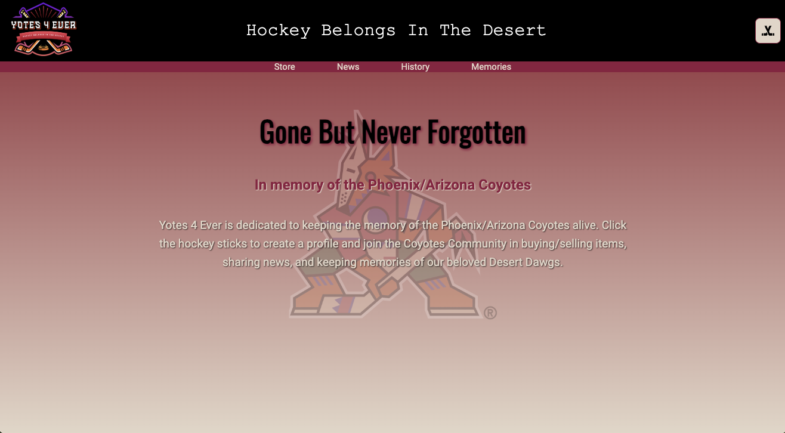
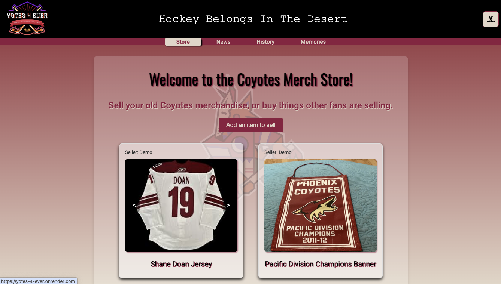
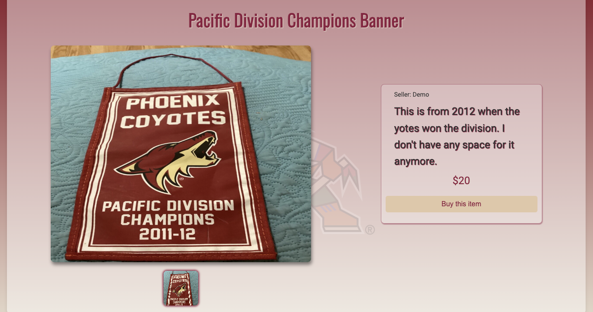
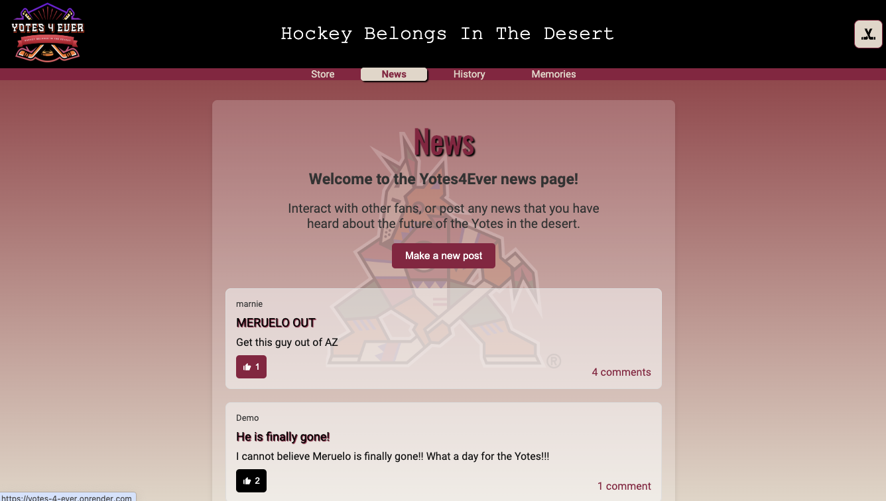
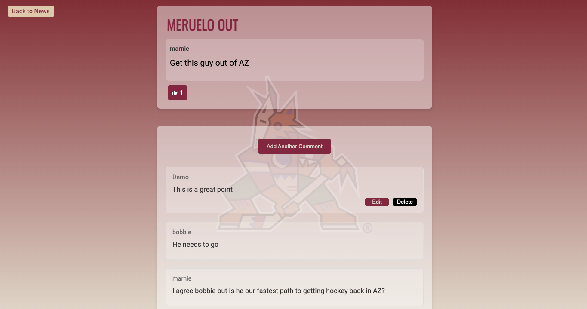
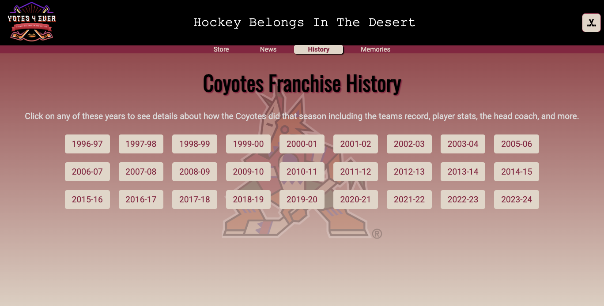
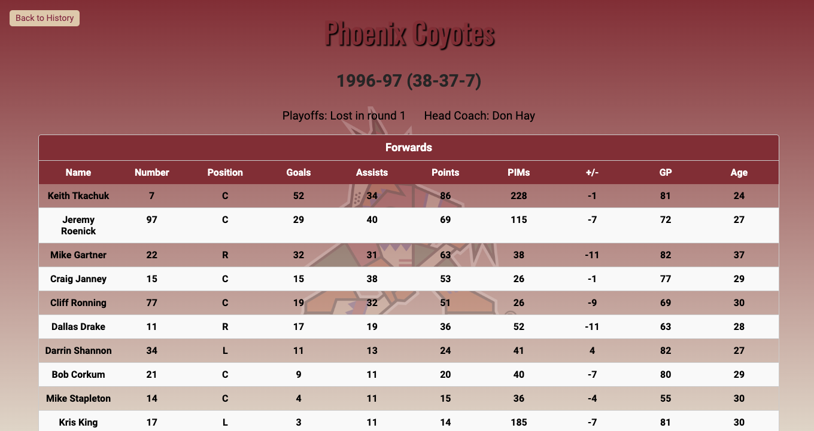
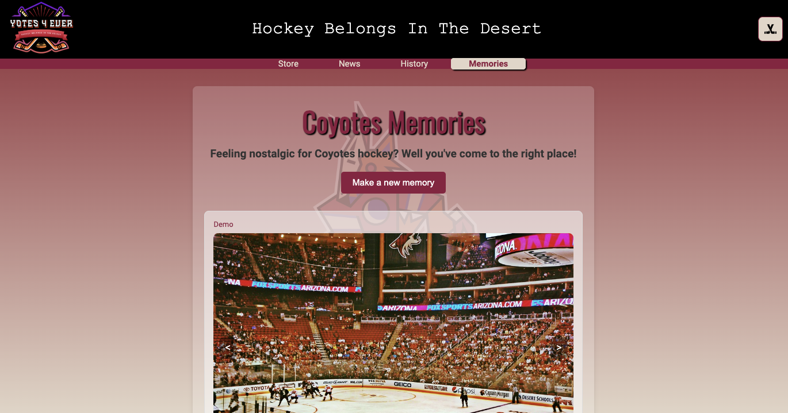
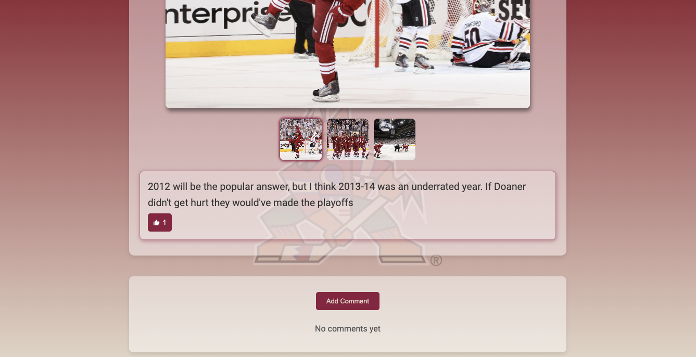

# Yotes 4 Ever

Check out the live site [here](https://yotes-4-ever.onrender.com)

Yotes 4 Ever is a website dedicated to keeping the memory of the Phoenix/Arizona Coyotes alive. Users can buy and sell team merchandise, post news about the team, share their memories of the team, and see the Coyotes historical stats.

## Technologies Used

-   **Backend:** Flask, PostgreSQL
-   **Frontend:** React, Redux

## Links
- [Database Schema](https://github.com/samcovert/yotes-4-ever/wiki/Database-Schema)
- [API Documentation](https://github.com/samcovert/yotes-4-ever/wiki/API-Documentation)
- [Feature List](https://github.com/samcovert/yotes-4-ever/wiki/Feature-List)
- [User Stories](https://github.com/samcovert/yotes-4-ever/wiki/User-Stories)
- [Original Wireframes](https://github.com/samcovert/yotes-4-ever/wiki/Wireframes)

## Installation Instructions
1. Clone this repository.

2. Install dependencies.
    ```bash
    pipenv install -r requirements.txt
    ```
3. Get into your pipenv, migrate your database, seed your database, and run your
   Flask app:
   ```bash
   pipenv shell
   ```
   ```bash
   flask db upgrade
   ```
   ```bash
   flask seed all
   ```
   ```bash
   flask run
   ```
4. cd into the react-vite directory, run `npm i`, then `npm run build`


## Screenshots
### Landing Page

### Merch Store


### News Page


### Team History


### Memories Page



